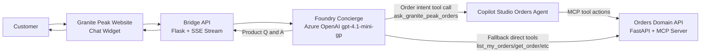
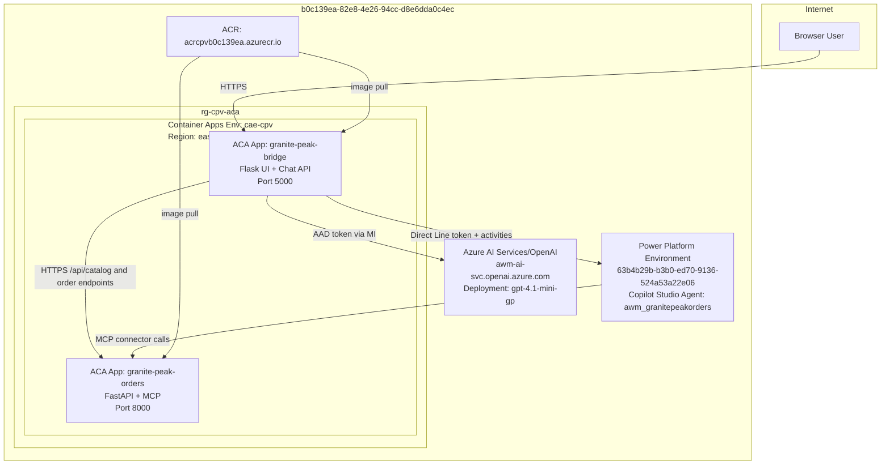

# Granite Peak Architecture Overview

This document explains how the Granite Peak demo works end-to-end.

Audience:
- Customer stakeholders
- Solution architects
- Sales/demo engineers

Scope:
- Public retail website and chat experience
- Foundry concierge orchestration
- Copilot Studio orders agent execution
- Orders API and MCP server hosting
- Azure deployment topology

## 1) What this solution does

A shopper opens one web chat on the Granite Peak website.

- Product questions are handled by the Foundry concierge.
- Order actions are routed to the Copilot Studio Orders Agent.
- The customer stays in one chat window and never switches apps.

UI source badges make this visible during demos:
- `CONCIERGE` = Foundry concierge generated the response.
- `ORDERS AGENT` = Copilot Studio agent handled the action.

## 2) Logical architecture

Routing rules:
- Product discovery and recommendations: Foundry concierge.
- Order and return operations: Copilot Studio Orders Agent first.
- Fallback if CS path fails: direct bridge tools to Orders API.

## 3) Physical architecture (Azure)

Runtime identity and auth:
- `granite-peak-bridge` uses system-assigned managed identity.
- Managed identity has `Cognitive Services OpenAI User` on `awm-ai-svc`.
- Copilot Studio accesses Orders MCP using the configured shared maker credential.

## 4) Component map (what lives where)

| Component | Purpose | Runtime location |
|---|---|---|
| Website UI (`index.html`, `chat.js`, `site.css`) | Storefront + chat UX | Served by `granite-peak-bridge` ACA |
| Bridge API (`app/app.py`) | `/api/chat` SSE, session management, catalog proxy | `granite-peak-bridge` ACA |
| Foundry client (`app/foundry_client.py`) | Model call loop, tool dispatch, source events | `granite-peak-bridge` ACA |
| CS Direct Line client (`app/cs_directline.py`) | CS conversation and activity polling | `granite-peak-bridge` ACA |
| Orders tools (`app/orders_tools.py`) | Direct fallback order APIs | `granite-peak-bridge` ACA |
| Orders API (`orders_api/main.py`) | Catalog, orders, returns endpoints | `granite-peak-orders` ACA |
| MCP server (`orders_api/main.py`, mounted `/mcp`) | Tool surface for CS | `granite-peak-orders` ACA |
| Copilot Studio agent (`awm_granitepeakorders`) | Order-domain reasoning and MCP tool use | Power Platform |
| Model deployment (`gpt-4.1-mini-gp`) | Concierge language and orchestration | Azure AI Services |

## 5) Customer-visible behavior

- One chat entry point for everything.
- Product questions answer fast without order backend calls.
- Order actions use real order records and return policy logic.
- Badges clearly show response source in a clean, minimal way.

## 6) Demo-ready verification checklist

- Open the site URL.
- Ask: "Do you sell mountain bikes?" => badge `CONCIERGE`.
- Ask: "List my orders" => badge `ORDERS AGENT`.
- Ask: "Cancel order ORD-2026-1300" => CS handles order policy response.
- Confirm no UI context switch and no second chat window.
