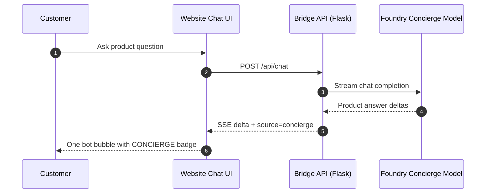
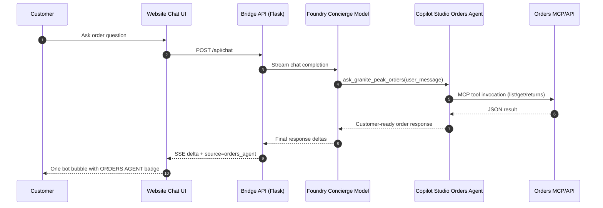
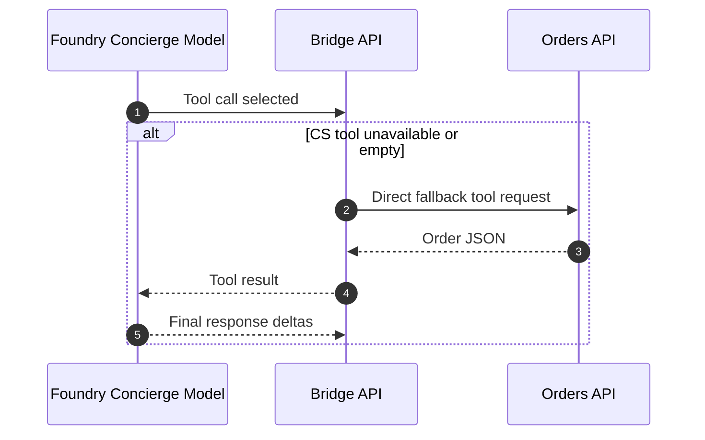

# Granite Peak Detailed Architecture

This document is the technical deep dive companion to `00-architecture-overview.md`.

## 1) Repository-to-runtime mapping

| Repo path | Responsibility | Runtime |
|---|---|---|
| `app/app.py` | Flask app; `/`, `/api/catalog`, `/api/chat`, `/healthz` | ACA `granite-peak-bridge` |
| `app/foundry_client.py` | Foundry streaming loop, tool-call dispatch, source-tag events | ACA `granite-peak-bridge` |
| `app/cs_tool.py` | `ask_granite_peak_orders` tool descriptor + dispatch | ACA `granite-peak-bridge` |
| `app/cs_directline.py` | Direct Line token mint, conversation start, poll replies | ACA `granite-peak-bridge` |
| `app/orders_tools.py` | Direct fallback tools for order APIs | ACA `granite-peak-bridge` |
| `app/session.py` | In-memory per-browser chat state | ACA `granite-peak-bridge` |
| `app/static/chat.js` | SSE client; source badge rendering | Browser |
| `orders_api/main.py` | Order domain API + MCP mount | ACA `granite-peak-orders` |
| `docs/02-cs-orders-setup.md` | Copilot Studio setup and tooling | Documentation |

## 2) End-to-end interaction flows

### 2.1 Product conversation flow



### 2.2 Order action flow (primary path)



### 2.3 Fallback flow if CS path is unavailable



## 3) Foundry loop internals

### 3.1 Why it drives the API directly (not a Foundry Agent Application)

The bridge calls `client.chat.completions.create(...)` on the Azure OpenAI
endpoint directly rather than using the Foundry Agent Application hosting
abstraction. Reasons:

- Tool dispatch must happen inside this Python process because `cs_directline.py`
  holds per-browser-session Direct Line conversation state in memory.
- The system prompt and tool descriptor are short and live in this repo — no
  operational benefit to hosting them inside Foundry.
- The wire format (Responses API) is identical between a raw Azure OpenAI
  deployment and a Foundry-hosted Agent Application, so upgrading later is a
  config-only change.

### 3.2 Tool-call loop

`foundry_client.handle_user_message()` runs a loop capped at **4 hops**. Each
hop sends the full message history (including any prior tool results) and
streams the response. If the model emits `tool_calls` chunks instead of content,
the bridge executes the tool, appends the result as a `tool` role message, and
calls the model again. When the model finally streams content the loop exits.

```
user message
    │
    ▼
chat.completions (streamed)
    │
    ├─ delta.content ────────────────► SSE stream → browser (done)
    │
    └─ delta.tool_calls
           │
           ▼
       cs_tool.dispatch()   →   cs_directline.ask()   →   CS agent
           │
           ▼
       append tool result to history
           │
           ▼
       chat.completions again (next hop, max 4)
```

### 3.3 Direct Line regional host

Copilot Studio issues tokens bound to a **regional** Direct Line gateway
(e.g. `unitedstates.directline.botframework.com`). The global endpoint
`directline.botframework.com` returns 404 for CS-issued tokens.

The correct host is derived at runtime: `POST /v3/directline/conversations`
with the CS token returns a `streamUrl`; `cs_directline.py` parses the
hostname from that URL and uses it for all subsequent calls in the session.
This is done once per browser session when the first order-related question
arrives.

### 3.4 Authentication chain

```
ACA container
  └─ system-assigned managed identity
       └─ DefaultAzureCredential  (azure-identity)
            └─ get_bearer_token_provider("https://cognitiveservices.azure.com/.default")
                 └─ AzureOpenAI client  →  model endpoint
```

No API keys are used or stored. The managed identity must have the
`Cognitive Services OpenAI User` role on the Azure OpenAI resource
(assigned in deployment runbook).

### 3.5 Local / stub mode

If `FOUNDRY_PROJECT_ENDPOINT` is not set, `handle_user_message()` falls
back to a deterministic stub that skips the model call entirely and returns
the Direct Line reply directly. This lets the CS integration and front-end
be developed and tested locally without an Azure OpenAI deployment.

## 4) Logical boundaries

| Boundary | Owned by | Notes |
|---|---|---|
| Experience boundary | Bridge web app | Customer entry point, UI state, SSE stream |
| Orchestration boundary | Foundry concierge | Intent handling and tool routing |
| Order-domain boundary | Copilot Studio agent | Business-friendly order operations |
| Data boundary | Orders API | Authoritative mock data and return rules |

## 4) Identity and security model

- Browser calls bridge over HTTPS.
- Bridge obtains AAD token using system-assigned managed identity.
- Bridge calls Azure AI model endpoint with AAD bearer token.
- Bridge calls Copilot Studio through Direct Line token endpoint.
- Copilot Studio MCP tool uses configured shared maker credential for backend actions.
- No customer PII authentication in v1 demo; customer identity is fixed (`GP-1001`).

## 5) Availability and scale notes

Current design is demo-optimized:
- Bridge session state is in-memory (single replica safest for deterministic behavior).
- Orders API is stateless and can scale horizontally.
- Container Apps revisions are rolled with explicit revision suffixes.

## 6) Observability points

- Bridge logs: session id, correlation id, tool-path behavior.
- ACA revision health: `active`, `healthState`, `trafficWeight`.
- CS test pane: confirms MCP tool execution (`Ran 1 tool` style trace).

## 7) Deployment inventory

| Layer | Resource |
|---|---|
| Resource group | `rg-cpv-aca` |
| Container app env | `cae-cpv` |
| Bridge app | `granite-peak-bridge` |
| Orders app | `granite-peak-orders` |
| Registry | `acrcpvb0c139ea.azurecr.io` |
| AI endpoint | `awm-ai-svc.openai.azure.com` |
| Power Platform env | `63b4b29b-b3b0-ed70-9136-524a53a22e06` |
| CS bot schema | `awm_granitepeakorders` |

## 8) What to show customers in a walkthrough

1. One chat window for product + order tasks.
2. Product question with `CONCIERGE` badge.
3. Order question with `ORDERS AGENT` badge.
4. Return-policy or cancel scenario with policy-safe handling.
5. Explain that orchestration is transparent to users, not a context switch.
