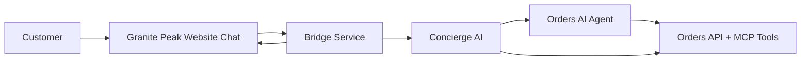
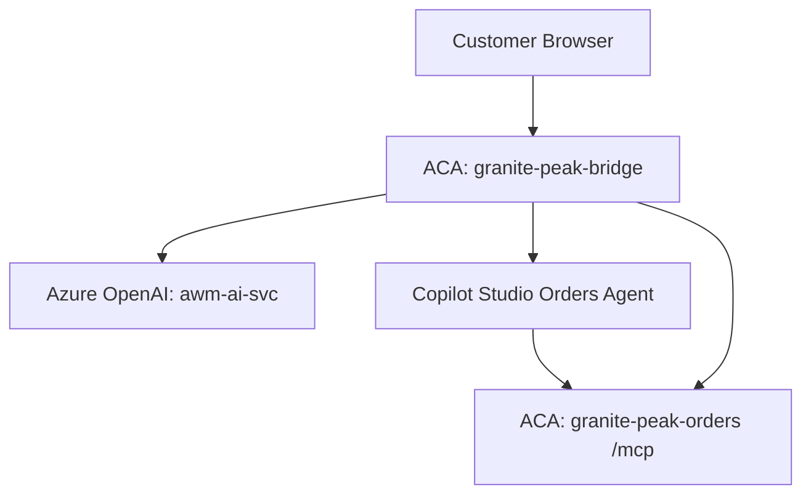

# Granite Peak Customer Architecture One-Pager

## What customer gets

One clean chat experience on the Granite Peak website.

- Ask for product advice.
- Ask about orders and returns.
- Stay in one conversation.

## How it works (simple)

- Concierge AI handles shopping questions.
- Orders AI handles order operations.
- Backend order system provides authoritative order data.

Customer does not need to know the internal handoff happened.

## Why this architecture matters

- Better user experience: one entry point.
- Safer operations: order actions handled by order-domain agent/tools.
- Faster delivery: modular services deploy independently.
- Better demo clarity: source badge shows which path answered.

## Logical architecture

## Physical architecture

## Live environment

- Website: `https://granite-peak-bridge.happyhill-34f7f143.eastus2.azurecontainerapps.io/`
- Region: `eastus2`
- Runtime: Azure Container Apps + Copilot Studio + Azure AI Services
